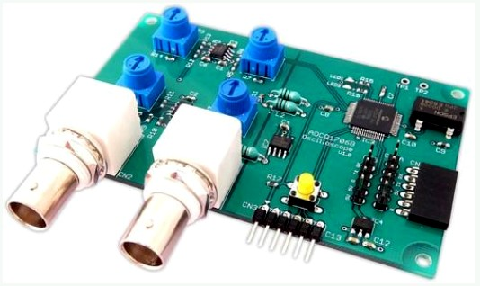
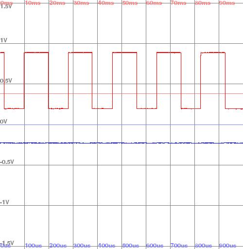

# ADCQ1706 USB Oscilloscope GUI

This is a Python PyGame-based GUI for this kind of oscilloscope board:

The original software only has support for Raspberry Pi, and limited to capturing data stored as image files. This software will display the information live.
Screenshot:\

It's controlled with the following key presses:
* 1 = Toggle channel #1
* 2 = Toggle channel #2
* 3 = Increase time/div for channel #1
* 4 = Decrease time/div for channel #1
* 5 = Increase time/div for channel #2
* 6 = Decrease time/div for channel #2
* 7 = Toggle rise/fall trigging for channel #1
* 8 = Toggle rise/fall trigging for channel #2
* E = Increase trig level for channel #1
* R = Decrease trig level for channel #1
* T = Increase trig level for channel #2
* Y = Decrease trig level for channel #2
* S = Screenshot"
* Q = Quit"

